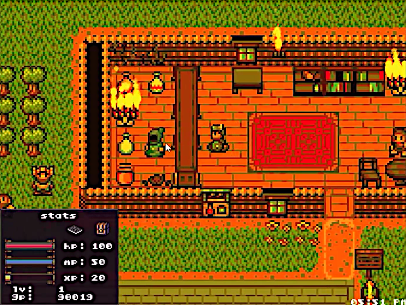

# Game: Land of BludBourne

BludBourne is a complete RPG game used as a reference implementation from the book "Mastering LibGDX Game Development".

**Controls**:
- **Up**, **Down**, **Left** and **Right** keys: moves the hero
- **W**, **S**, **A** and **D** keys: moves the hero

## Setup

- **Java** 8
- **Gradle** Wrapper 6.7.1
- **LigGDX** 1.9.14: https://github.com/libgdx/libgdx
- **GDX Liftoff** 1.9.14: https://github.com/tommyettinger/gdx-liftoff

## Disclaimer

This game is the result of reading, studying and learning the examples shown in the book "**Mastering LibGDX Game Development**" by the author Patrick Hoey.

- **Book site**: https://www.packtpub.com/product/mastering-libgdx-game-development/9781785289361
- **Source-code**: https://github.com/patrickhoey/BludBourne
